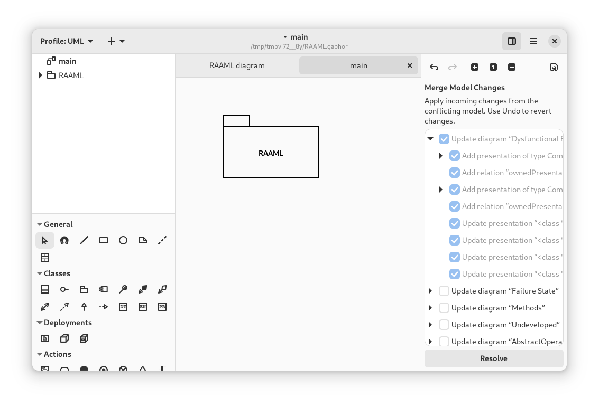

# Resolve Merge Conflicts

Suppose you’re working on a model. If you create a change, while someone else has
also made changes, there’s a fair chance you'll end up with a merge conflict.

Gaphor tries to make the changes to a model as small as possible: all elements are
stored in the same order. However, since a Gaphor model is a persisted graph of objects,
merging changes is not as simple as opening a text editor.

From Gaphor 2.18 onwards Gaphor is also capable of merging models.
Once a merge conflict has been detected, Gaphor will offer the option to open the current model,
the incoming model or merge changes manually via the Merge Editor.


If you choose *Open Merge Editor*, both models will be loaded. The current model remains as is.
In addition, the changes made to the incoming model are calculated. Those changes are stored as _pending change_ objects in the model.

```{tip}
Pending changes are part of the model, you can save the model with changes and resolve those at a later point.
```

The Merge Editor is shown on the right side, replacing the (normal) Property Editor.



Merge actions are grouped by diagram, where possible.
When you apply a change, all changes listed as children are also applied.
Once changes are applied, they can only be reverted by undoing the change (hit _Undo_).

```{note}
The Merge Editor replaces the Property Editor, as long as there are pending changes in the model.

It is concidered good practice to resolve the merge conflict before you continue modeling.
```

When all conflicts have been resolved, press *Resolve* to finish merge conflict resolution.
